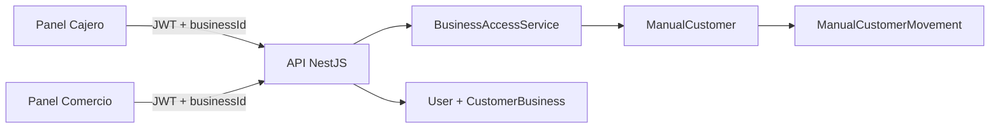

# Arquitectura — MiClub Chile v1.1

Monorepo npm con cinco aplicaciones React/Vite y API NestJS/Prisma/PostgreSQL.

| Módulo | Responsabilidad |
|---|---|
| `apps/customer` | cuenta global, inscripción por QR, beneficios y PWA Cliente |
| `apps/commerce` | programa, clientes digitales/manuales, equipo, QR y PWA Comercio |
| `apps/cashier` | operación digital/manual, transacciones, canjes y PWA Cajero |
| `apps/admin` | administración global de plataforma |
| `apps/landing` | sitio público |
| `backend/api` | autenticación, autorización, dominio y persistencia |

La identidad digital vive en `User`; las participaciones viven en `CustomerBusiness`. La lealtad digital se particiona en `Cycle`, `Transaction` y `Reward` por `businessId`. Los clientes manuales usan tablas separadas y nunca autentican.

`BusinessAccessService` valida comercio activo, membresía y rol. Los controladores no confían en IDs enviados por el frontend sin esta validación.

Cada PWA tiene manifest separado e iconos 192/512. Workbox genera `sw.js`; `PwaInstallPrompt` es UI compartida, no reemplaza los criterios de instalación de Chrome.

El cliente manual nunca entra en `User`. Cajero y Comercio comparten la API, pero cada consulta queda limitada al comercio validado.

Más detalle: [Libro Maestro](libro-maestro.md), [Base de datos](database.md), [API](api.md).
